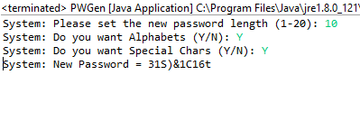
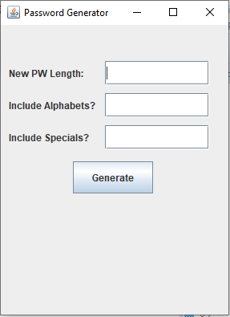
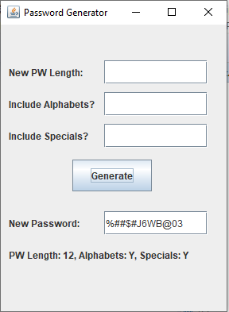

### *Name: Chanyu C.*

### Program Name: Random Password Generator

### Description:
```
This is a Java program where the program generates 
the password according to users need. It may contain 
alphabets or special letters if the user enables the 
options. The randomized password will be secure, and 
prevent being hacked from being a datamine victim.

I coded this program for myself to use it, but anyone
may use this program if they want random series of pws.
```

### Pictures:

#### Console view:
<a href = "Pictures/pic1.PNG">

#### GUI implementation:
<a href = "Pictures/pic2.PNG">
<a href = "Pictures/pic3.PNG">